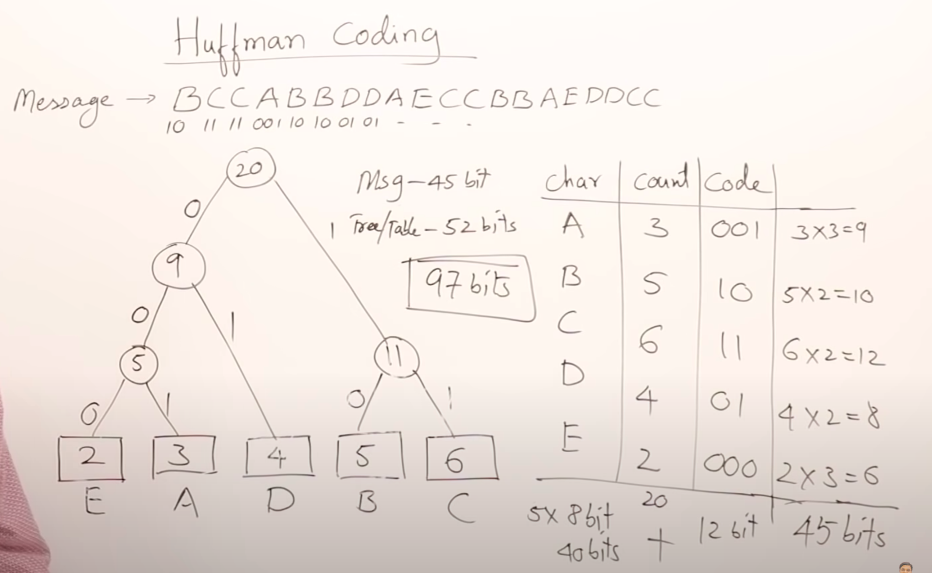

# Huffman coding

* used for data compression

## Problem description

Suppose we have the message "BCCABBDDAECCBBAEDDCC"

Each character is encoded using ASCII, hence 8 bits for each character.

The thing is that we can use our own encoding.

```Example``` The message above only uses the letters 'A' through 'E', hence we can encode it a lot more efficiently than ASCII.  
In this case only 3 bits are sufficient for encoding a character.


A way for encoding -> A way for decoding  strings.


Hence, along with the encoded message, you need to send the table for decoding the message. 

|Character|count/frequency|code|
|---------|---------------|----|
|A|3/20|000|
|B|5/20|001|
|C|5/20|010|
|D|4/20|011|
|E|2/20|100|


The letters need to be sent in the original ASCII encoding,  hence 5 * (3 + 8) = 55

The size of the message in the new encoding is 60 bits.

A total of 115 bits sent, which is an advantage over the 160 bits sent by regular ASCII.

This is in the case of fixed size code.


## Huffman coding 

In the case of variable size code.  

We don't have to take fixed size code for the alphabets. 


The idea is to give small size code for the more appearing characters. 

All the characters in the string must be ordered increasingly by their count.   




